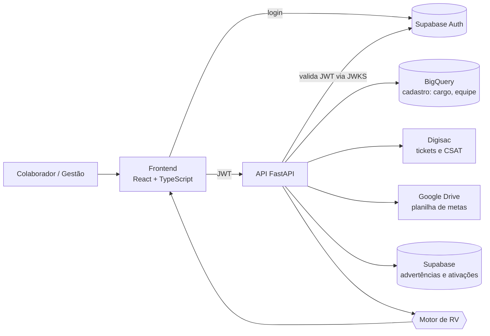

# RV — Remuneração Variável e Desempenho em tempo real

> Transformei dados que estavam parados, sem uso, em relatórios claros que mostram a cada colaborador **quanto do seu esforço virou resultado**: o que foi feito, qual era a meta, e se ela foi batida ou não.

**Projeto 100% autoral e full stack:** eu idealizei, modelei, programei e coloquei no ar tudo o que está aqui, do banco de dados à tela.


## O problema

Uma empresa de cobrança gera muitos dados todos os dias: atendimentos e pesquisas de satisfação na plataforma de mensagens (Digisac), planilhas de metas e produtividade, cadastro de colaboradores. Só que esses dados **ficavam parados, sem virar informação útil**.

Na prática, isso significava que:

- o colaborador tinha dificuldade de enxergar como o trabalho dele se traduzia em resultado;
- as regras da remuneração variável (RV) viviam numa planilha, separadas dos dados reais de atendimento;
- reconhecer o esforço de cada pessoa dependia de juntar e comparar informações de fontes diferentes.

## A solução

Construí uma plataforma que **busca os dados nas fontes, cruza, compara com as metas e entrega o resultado pronto**: para cada colaborador, um painel que mostra o desempenho do mês, a faixa de meta atingida, quais semanas foram batidas e quanto isso rendeu de RV, com o detalhamento de cada parte do cálculo.

Para a gestão, um painel administrativo com a operação ao vivo, registro de ocorrências e automação de listas de cobrança.

O resultado é transparência: o colaborador vê o próprio esforço reconhecido em números, e a gestão deixa de caçar informação em várias planilhas.

---

## O que eu construí (full stack)

| Camada | O que fiz |
|---|---|
| **Frontend** | SPA em React 19 + TypeScript + Vite + Tailwind 4: dashboard do colaborador, painel administrativo, rotas protegidas por cargo, tela ao vivo com atualização automática. |
| **Backend** | API em FastAPI (Python 3.11) com validação de JWT, controle de acesso por cargo e execução em paralelo das consultas externas. |
| **Motor de cálculo** | Módulo próprio que transforma as regras da RV em código: faixas de meta, bônus de qualidade, consistência semanal e ativação. |
| **Integrações** | API do Digisac (tickets, CSAT, tempo real), Google Drive (planilha de metas), BigQuery (cadastro de colaboradores), Supabase (autenticação e ocorrências), Cloud Storage. |
| **Dados** | Modelagem da tabela de colaboradores no BigQuery, tabelas de ocorrências no Supabase e script de criação do dataset. |
| **Infra e deploy** | Dockerfile para Cloud Run, frontend em Firebase Hosting, CORS restrito aos domínios do sistema. |

---

## Como funciona



**O que acontece quando o colaborador abre o dashboard:**

1. Ele faz login (Supabase) e o frontend chama `GET /api/desempenho/me` com o token.
2. A API valida o token e busca no BigQuery o cargo, a equipe e o ID dele no Digisac.
3. Em paralelo, consulta o Digisac (tempo de atendimento, primeira resposta, CSAT), lê as metas na planilha e busca as ocorrências no Supabase.
4. O motor de RV cruza tudo, define as faixas e calcula cada parte da remuneração.
5. O frontend mostra o resultado com o detalhamento: meta, faixa, semanas batidas, bônus e total.

---

## Regras de cálculo da RV

Todos os valores em R$. O percentual da meta define a faixa:

| Faixa (% da meta) | Individual: operador | Individual: vice-líder/líder | Coletivo (cada) |
|---|---:|---:|---:|
| Abaixo de 95% | 0 | 0 | 0 |
| 95% a 99% | 20 | 50 | 0 |
| 100% a 119% | 40 | 100 | 40 |
| 120% a 149% | 60 | 100 | 40 |
| 150% a 199% | 80 | 150 | 80 |
| 200% ou mais | 80 | 150 | 80 |

- **Individual:** vem da meta pessoal e é mostrado dividido nas 4 semanas do mês.
- **Coletivo:** soma da faixa da subequipe com a faixa do time geral.
- **Semana batida:** semana em que o colaborador chegou a 100% ou mais da meta semanal.

**Bônus de qualidade:**

| Critério | Condição | Bônus |
|---|---|---:|
| Tempo médio de atendimento | menos de 60 min | 15 |
| Primeira resposta | menos de 30 min | 15 |
| NPS (CSAT) | acima de 80% | 20 |
| Novos CPCs | mais de 100 | 20 |
| Registro no sistema | 95% ou mais | 20 |
| Avaliações no Google | 2 ou mais | 15 |
| Zero erros | sem advertência nem erro grave | 15 |

Um **erro grave** zera todo o bônus de qualidade.

**Outros bônus:**

- **Consistência semanal:** 3 de 4 semanas batidas rende 30; 4 de 4 rende 50.
- **Promoções (ciclos 1 e 2):** cada ciclo é uma promoção que dá bônus ao colaborador. Rende 50 por ciclo ativado pela gestão.

---

## Funcionalidades

**Para o colaborador**
- Login e dashboard pessoal com a RV total e o detalhamento de cada parte.
- Comparação entre meta e resultado, com a faixa atingida.
- Indicadores de atendimento: tempo médio, primeira resposta, chamados fechados e CSAT.
- Quantas semanas bateram a meta (de 4) e os limites do bônus de consistência.
- Situação de ocorrências e das promoções ativadas.

**Para a gestão** (admin, RH e vice-líder, controlado por cargo)
- **Colaboradores ao vivo:** atendimentos em tempo real por departamento e por atendente, com atualização a cada 30 segundos.
- **Registrar advertência ou erro grave** de um colaborador.
- **Ativar ou desativar as promoções** (ciclos 1 e 2), que dão bônus ao colaborador.
- **Criar listas de cobrança:** automação que lê a pesquisa de clientes e a planilha de estratégia, aplica os filtros (faixa de atraso, CPC, coligadas, marcadores, valor mínimo), atualiza o valor com juros, multa e honorários e gera o CSV pronto para o Digisac.
- **Painel de campanhas:** envios, visualizações, taxa de abertura, custo e comparação com o período anterior.

---

## Decisões técnicas que valem destaque

- **Falhar alto em vez de calcular errado.** Se a leitura da planilha de metas falha, a API responde 503 em vez de calcular a RV com valores padrão silenciosos. Se o layout da planilha muda e nenhum colaborador é reconhecido, também levanta erro.
- **Paralelismo.** Digisac, planilha e Supabase não dependem uns dos outros, então rodam juntos (`asyncio.gather` + threadpool), o que reduz o tempo de resposta do dashboard.
- **Resiliência com a API externa.** Chamadas ao Digisac com retry e espera exponencial para limites de requisição (403/429).
- **Segurança em camadas.** O token (ES256) é validado via JWKS do Supabase. O cargo vem do BigQuery, que é a fonte de verdade, e não do token. As rotas administrativas são protegidas no backend, e a checagem do frontend serve só para a interface.
- **Regras como código.** As faixas e os bônus ficam em tabelas declarativas no motor de RV, fáceis de ler, ajustar e testar.
- **Tolerância a falhas parciais.** Um erro no Supabase não derruba o dashboard inteiro, e na tela ao vivo a falha da lista de atendentes não esconde os totais dos departamentos.

---

## Endpoints principais

| Método | Rota | Descrição | Acesso |
|---|---|---|---|
| GET | `/api/desempenho/me` | Dashboard e RV do colaborador logado | Autenticado |
| GET | `/api/digisac/agora/atendentes` | Atendentes em tempo real | Autenticado |
| POST | `/api/admin/registrar` | Registra advertência ou erro grave | Admin, RH, vice-líder |
| POST | `/api/admin/ativar` e `/desativar` | Ativa ou desativa a promoção por ciclo | Admin, RH |
| POST | `/api/campanha/ingerir` | Ingere a pesquisa de clientes no BigQuery | Admin, RH, vice-líder |
| POST | `/api/campanha/processar` | Gera as listas (CSV) por template | Admin, RH, vice-líder |

---

## Estrutura do repositório

```
RV.usuarios/
├── crv/                          # Frontend (React + TypeScript + Vite)
│   └── src/
│       ├── pages/                # Dashboard do colaborador
│       │   └── admin/            # Telas de gestão
│       ├── components/           # Sidebar, ProtectedRoute
│       ├── AuthContext.tsx       # Sessão, cargo e equipe
│       └── supabaseClient.ts
└── pb/                           # Backend (FastAPI)
    ├── main.py                   # App, CORS e routers
    ├── app/
    │   ├── auth.py               # Validação do JWT e cargo
    │   ├── rv_calculator.py      # Motor de cálculo da RV
    │   ├── digisac_client.py     # Tickets, CSAT e tempo real
    │   ├── sheets_client.py      # Leitura das metas (planilha P&P)
    │   ├── bigquery_client.py    # Cadastro de colaboradores
    │   ├── supabase_client.py    # Ocorrências e ativações
    │   ├── schemas.py            # Modelos Pydantic
    │   ├── routers/              # Rotas da API
    │   ├── middleware/           # Dependências de permissão
    │   └── services/campanha/    # Pipeline de listas de cobrança
    ├── Dockerfile
    └── setup_bigquery.sh         # Cria dataset e tabela de colaboradores
```

---

## Como rodar

### Pré-requisitos
Python 3.11+, Node 20+, um projeto Supabase, um projeto Google Cloud (BigQuery e Drive API) e um token da API do Digisac.

### Backend

```bash
cd pb
python -m venv .venv && source .venv/bin/activate
pip install -r requirements.txt

# Credenciais do Google via Application Default Credentials
gcloud auth application-default login

# Cria o dataset e a tabela de colaboradores no BigQuery
PROJECT_ID=seu-projeto ./setup_bigquery.sh

# Crie o arquivo pb/.env com as variáveis listadas abaixo
uvicorn main:app --reload --port 8080
```

Com Docker:

```bash
docker build -t rv-api ./pb
docker run -p 8080:8080 --env-file pb/.env rv-api
```

**Variáveis de ambiente do backend (`pb/.env`):**

```
DIGISAC_BASE_URL=
DIGISAC_TOKEN=
SUPABASE_URL=
SUPABASE_SERVICE_KEY=
BQ_PROJECT_ID=
BQ_DATASET=rh
BQ_TABLE_COLABORADORES=colaboradores
GOOGLE_SHEETS_SPREADSHEET_ID=
GOOGLE_SHEETS_ABA_PRODUTIVIDADE=P&P
FRONTEND_ORIGIN=http://localhost:5173
```

**Tabelas necessárias no Supabase:** `advertencias`, `erros_graves` e `promocoes_ativacoes` (com chave única em `email, ciclo`).

### Frontend

```bash
cd crv
npm install
npm run dev
```

**Variáveis de ambiente do frontend (`crv/.env`):**

```
VITE_SUPABASE_URL=
VITE_SUPABASE_ANON_KEY=
VITE_API_URL=http://localhost:8080
```

Build de produção: `npm run build` (gera `dist/`, pronto para o Firebase Hosting).

> **Nunca** versione `.env` nem chaves de service account. Use variáveis de ambiente ou as credenciais padrão do ambiente (Cloud Run).

---

## Próximos passos

- Alimentar no motor os critérios que ainda não têm fonte automática (novos CPCs, registro no sistema, avaliações no Google) e a meta geral do time. O cálculo já está pronto para recebê-los.
- Relatórios exportáveis (CSV e planilha) a partir do painel administrativo.
- Testes automatizados para o motor de RV, que é todo baseado em regras e combina bem com testes em tabela.
- Casar colaborador e planilha por ID em vez do primeiro nome.
- Concluir a ligação do painel de campanhas entre frontend e API.

---

## Autor

Projeto concebido e desenvolvido por mim, de ponta a ponta: levantamento do problema, regras de negócio, modelagem de dados, backend, integrações, frontend e deploy.

<!-- Adicione aqui seu nome, LinkedIn e GitHub. -->
